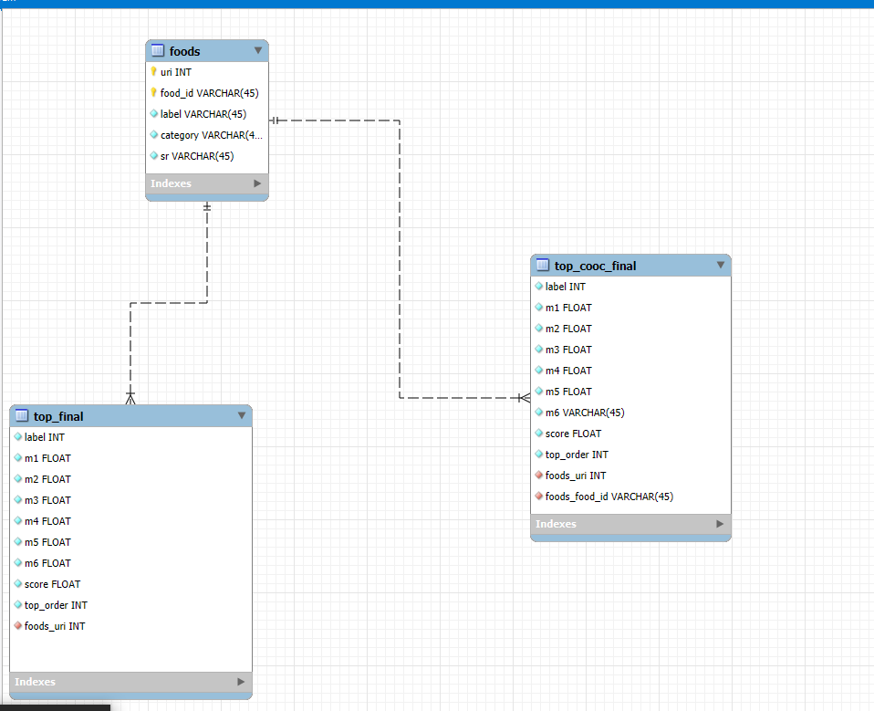
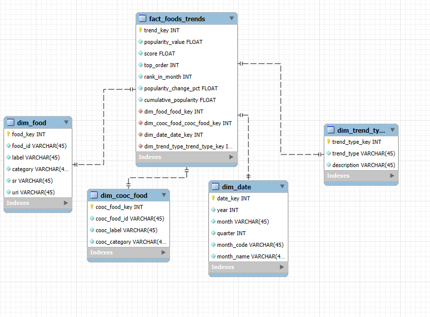
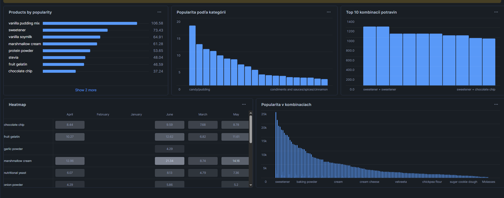

# ELT proces datasetu Food Trends

Tento repozitár predstavuje implementáciu ELT procesu v Snowflake a vytvorenie dátového skladu so schémou Star Schema. Projekt pracuje s datasetom **Food Analytics and Food Trends Data in Web Recipes** zo Snowflake Marketplace. Projekt sa zameriava na analýzu popularity potravín a ich kombinácií v receptoch počas obdobia prvého polroka 2024.

## Obsah

- [Úvod a popis zdrojových dát](#úvod-a-popis-zdrojových-dát)
- [Návrh dimenzionálneho modelu](#návrh-dimenzionálneho-modelu)
- [ELT proces v Snowflake](#elt-proces-v-snowflake)
- [Vizualizácia dát](#vizualizácia-dát)
- [Záver](#záver)

---

## Úvod a popis zdrojových dát

### Účel analýzy

Dataset bol vybraný pre potreby analýzy trendov v gastronomickom priemysle a potravinárskom sektore. Analyzujeme dáta o popularite potravín vo webových receptoch s cieľom porozumieť:

- Trendom v používaní jednotlivých potravín
- Obľúbeným kombináciám ingrediencií
- Zmenám popularity v čase
- Najpopulárnejším potravinám podľa kategórií

### Biznis proces

Dáta podporujú nasledujúce biznis procesy:

- **Food Industry Analytics** - identifikácia trendujúcich potravín a ingrediencií
- **Recipe Optimization** - zisťovanie populárnych kombinácií potravín
- **Market Research** - pochopenie sezónnych trendov v stravovaní
- **Menu Planning** - strategické rozhodovanie o ponuke v reštauráciách

### Zdrojové dáta

Zdrojové dáta pochádzajú z Snowflake Marketplace datasetu:

- **Databáza:** `FOOD_ANALYTICS_AND_FOOD_TRENDS_DATA_IN_WEB_RECIPES`
- **Schéma:** `PUBLIC`

Dataset obsahuje tri hlavné tabuľky:

| Tabuľka | Popis | Význam |
|---------|-------|--------|
| **FOODS** | Katalóg potravín s identifikátormi, názvami, kategóriami a URI odkazmi | Master zoznam všetkých potravín s ich metadátami |
| **TOP_FINAL** | Mesačná popularita jednotlivých potravín (M1-M6), skóre a ranking | Hlavný zdroj dát o popularite potravín v čase |
| **TOP_COOC_FINAL** | Ko-výskyt potravín - páry potravín a ich mesačná popularita | Dáta o kombinovaní potravín v receptoch |

### ERD diagram pôvodnej štruktúry

Surové dáta sú usporiadané v relačnom modeli, ktorý je znázornený na entitno-relačnom diagrame:



*Obrázok 1: Entitno-relačná schéma zdrojových dát*

---

## Návrh dimenzionálneho modelu

### Star Schema

Navrhnutá schéma hviezdy (Star Schema) obsahuje 1 faktovú tabuľku **FACT_FOOD_TRENDS** prepojenú s 4 dimenziami:



*Obrázok 2: Schéma hviezdy pre Food Trends dataset*

### Dimenzie

#### DIM_FOOD (SCD Type 1)

**Účel:** Katalóg všetkých potravín s ich metadátami

**Atribúty:**
- `FOOD_KEY` (PK - surrogate key)
- `FOODID` (business key)
- `LABEL` - názov potraviny
- `CATEGORY` - kategória potraviny
- `SR`, `URI` - referencie

**SCD Type 1:** Jednoduché prepisovanie pri zmenách bez histórie

**Vzťah:** 1:N k faktovej tabuľke

#### DIM_COOC_FOOD (SCD Type 1)

**Účel:** Katalóg potravín vyskytujúcich sa v kombináciách

**Atribúty:**
- `COOC_FOOD_KEY` (PK)
- `COOC_FOOD_ID` (business key)
- `COOC_LABEL` - názov kombinovanej potraviny
- `COOC_CATEGORY` - kategória

**SCD Type 1:** Aktualizácia hodnôt bez histórie

**Vzťah:** 1:N k faktovej tabuľke

#### DIM_DATE (SCD Type 0)

**Účel:** Časová dimenzia pre analýzu mesačných trendov

**Atribúty:**
- `DATE_KEY` (PK)
- `YEAR` - rok (2024)
- `MONTH` - číslo mesiaca (1-6)
- `QUARTER` - štvrťrok
- `MONTH_CODE` - M1, M2, M3, M4, M5, M6
- `MONTH_NAME` - názov mesiaca

**SCD Type 0:** Statická tabuľka, záznamy sa nemenia

**Vzťah:** 1:N k faktovej tabuľke

#### DIM_TREND_TYPE (SCD Type 0)

**Účel:** Rozlíšenie typu trendu (jednotlivá potravina vs. kombinácia)

**Atribúty:**
- `TREND_TYPE_KEY` (PK)
- `TREND_TYPE` - 'SINGLE' alebo 'CO_OCCURRENCE'
- `DESCRIPTION` - popis typu trendu

**SCD Type 0:** Statický справочник

**Vzťah:** 1:N k faktovej tabuľke

### Faktová tabuľka FACT_FOOD_TRENDS

**Primárny kľúč:** `TREND_KEY` (AUTOINCREMENT)

**Cudzie kľúče:**
- `FOOD_KEY` → DIM_FOOD
- `COOC_FOOD_KEY` → DIM_COOC_FOOD
- `DATE_KEY` → DIM_DATE
- `TREND_TYPE_KEY` → DIM_TREND_TYPE

**Metriky:**
- `POPULARITY_VALUE` - hodnota popularity v danom mesiaci
- `SCORE` - celkové skóre
- `TOP_ORDER` - poradie v rankingu
- `RANK_IN_MONTH` - ranking v rámci mesiaca (ROW_NUMBER)
- `PREV_POPULARITY` - popularita v predchádzajúcom mesiaci (LAG)
- `POPULARITY_CHANGE_PCT` - percentuálna zmena popularity
- `CUMULATIVE_POPULARITY` - kumulatívna popularita (SUM OVER)

**Window Functions:**
- `ROW_NUMBER()` - ranking potravín podľa popularity v každom mesiaci
- `LAG()` - získanie hodnoty z predchádzajúceho mesiaca
- `SUM() OVER` - kumulatívny súčet popularity v čase

---

## ELT proces v Snowflake

### Extract (Extrahovanie dát)

Dáta boli extrahované zo Snowflake Marketplace do staging schémy.

**Vytvorenie staging tabuliek:**

```sql
USE WAREHOUSE TERMITE_WH;
USE DATABASE TERMITE_DB;
CREATE OR REPLACE SCHEMA STAGING;

-- Staging: FOODS
CREATE OR REPLACE TABLE STG_FOODS AS
SELECT * FROM FOOD_ANALYTICS_AND_FOOD_TRENDS_DATA_IN_WEB_RECIPES.PUBLIC.FOODS;

-- Staging: TOP_FINAL
CREATE OR REPLACE TABLE STG_TOP_FINAL AS
SELECT * FROM FOOD_ANALYTICS_AND_FOOD_TRENDS_DATA_IN_WEB_RECIPES.PUBLIC.TOP_FINAL;

-- Staging: TOP_COOC_FINAL
CREATE OR REPLACE TABLE STG_TOP_COOC_FINAL AS
SELECT * FROM FOOD_ANALYTICS_AND_FOOD_TRENDS_DATA_IN_WEB_RECIPES.PUBLIC.TOP_COOC_FINAL;
```

**Účel:** Staging tabuľky slúžia ako dočasné úložisko surových dát pred ich transformáciou.

### Transform (Transformácia dát)

Hlavné transformácie zahŕňali:

- **Deduplikácia:** Použitie DISTINCT pre odstránenie duplicitných záznamov
- **Handling NULL hodnôt:** `COALESCE(CATEGORY, 'Unknown')` pre kategórie
- **Unpivoting:** Transformácia mesačných stĺpcov (M1-M6) do riadkov pre time-series analýzu
- **Výpočet metrík:** Percentuálna zmena popularity, kumulatívne hodnoty

### Load (Načítanie dát)

#### Vytvorenie dimenzií

**DIM_DATE - Časová dimenzia:**

```sql
CREATE OR REPLACE TABLE DIM_DATE AS
WITH months AS (
    SELECT 1 AS month_num, 'M1' AS month_code, 'January' AS month_name
    UNION ALL SELECT 2, 'M2', 'February'
    UNION ALL SELECT 3, 'M3', 'March'
    UNION ALL SELECT 4, 'M4', 'April'
    UNION ALL SELECT 5, 'M5', 'May'
    UNION ALL SELECT 6, 'M6', 'June'
)
SELECT
    ROW_NUMBER() OVER (ORDER BY month_num) AS DATE_KEY,
    2024 AS YEAR,
    month_num AS MONTH,
    CEIL(month_num / 3.0) AS QUARTER,
    month_code AS MONTH_CODE,
    month_name AS MONTH_NAME
FROM months;
```

**DIM_FOOD - Katalóg potravín:**

```sql
CREATE OR REPLACE TABLE DIM_FOOD AS
SELECT DISTINCT
    ROW_NUMBER() OVER (ORDER BY FOODID) AS FOOD_KEY,
    FOODID,
    LABEL,
    COALESCE(CATEGORY, 'Unknown') AS CATEGORY,
    SR,
    URI
FROM TERMITE_DB.STAGING.STG_FOODS
WHERE FOODID IS NOT NULL;
```

**DIM_TREND_TYPE - Typ trendu:**

```sql
CREATE OR REPLACE TABLE DIM_TREND_TYPE AS
SELECT 1 AS TREND_TYPE_KEY, 'SINGLE' AS TREND_TYPE, 
       'Individual food popularity' AS DESCRIPTION
UNION ALL
SELECT 2, 'CO_OCCURRENCE', 'Food combination popularity';
```

#### Vytvorenie faktovej tabuľky s Window Functions

```sql
CREATE OR REPLACE TABLE FACT_FOOD_TRENDS AS
WITH unpivoted_single AS (
    SELECT
        s.FOOD_ID,
        1 AS TREND_TYPE_KEY,
        d.DATE_KEY,
        CASE d.MONTH_CODE
            WHEN 'M1' THEN s.M1
            WHEN 'M2' THEN s.M2
            WHEN 'M3' THEN s.M3
            WHEN 'M4' THEN s.M4
            WHEN 'M5' THEN s.M5
            WHEN 'M6' THEN s.M6
        END AS POPULARITY_VALUE,
        s.SCORE,
        s.TOP_ORDER
    FROM TERMITE_DB.STAGING.STG_TOP_FINAL s
    CROSS JOIN DIM_DATE d
),
with_analytics AS (
    SELECT
        c.*,
        f.FOOD_KEY,
        -- Window Function 1: ROW_NUMBER() - Ranking v rámci mesiaca
        ROW_NUMBER() OVER (
            PARTITION BY c.DATE_KEY, c.TREND_TYPE_KEY
            ORDER BY c.POPULARITY_VALUE DESC
        ) AS RANK_IN_MONTH,
        -- Window Function 2: LAG() - Predchádzajúca hodnota
        LAG(c.POPULARITY_VALUE) OVER (
            PARTITION BY c.FOOD_ID, c.TREND_TYPE_KEY
            ORDER BY c.DATE_KEY
        ) AS PREV_POPULARITY,
        -- Window Function 3: SUM() OVER - Kumulatívny súčet
        SUM(c.POPULARITY_VALUE) OVER (
            PARTITION BY c.FOOD_ID, c.TREND_TYPE_KEY
            ORDER BY c.DATE_KEY
            ROWS BETWEEN UNBOUNDED PRECEDING AND CURRENT ROW
        ) AS CUMULATIVE_POPULARITY
    FROM combined c
    JOIN DIM_FOOD f ON c.FOOD_ID = f.FOODID
)
SELECT
    ROW_NUMBER() OVER (ORDER BY DATE_KEY, FOOD_KEY) AS TREND_KEY,
    FOOD_KEY,
    DATE_KEY,
    TREND_TYPE_KEY,
    POPULARITY_VALUE,
    SCORE,
    TOP_ORDER,
    RANK_IN_MONTH,
    CASE
        WHEN PREV_POPULARITY IS NULL OR PREV_POPULARITY = 0 THEN NULL
        ELSE ((POPULARITY_VALUE - PREV_POPULARITY) / PREV_POPULARITY) * 100
    END AS POPULARITY_CHANGE_PCT,
    CUMULATIVE_POPULARITY
FROM with_analytics
WHERE POPULARITY_VALUE IS NOT NULL;
```

**Vysvetlenie Window Functions:**

- `ROW_NUMBER()`: Každá potravina dostáva ranking v rámci mesiaca podľa popularity
- `LAG()`: Umožňuje porovnanie s predchádzajúcim mesiacom pre výpočet zmeny
- `SUM() OVER`: Sleduje kumulatívny rast popularity v čase

---

## Vizualizácia dát

Dashboard obsahuje 5 vizualizácií poskytujúcich komplexný prehľad o kľúčových metrikách a trendoch v popularite potravín.



*Obrázok 3: Dashboard s vizualizáciami food trends*

### Vizualizácia 1: Top produkty podľa popularity

**SQL dotaz:**

```sql
SELECT 
    df.LABEL,
    SUM(f.POPULARITY_VALUE) AS TOTAL_POPULARITY
FROM FACT_FOOD_TRENDS f
JOIN DIM_FOOD df ON f.FOOD_KEY = df.FOOD_KEY
WHERE f.TREND_TYPE_KEY = 1
GROUP BY df.LABEL
ORDER BY TOTAL_POPULARITY DESC
LIMIT 10;
```

**Interpretácia:** Tento horizontálny stĺpcový graf zobrazuje 10 najpopulárnejších potravín naprieč všetkými mesiacmi. Vanilla pudding mix jednoznačne dominuje s celkovou popularitou 106.58, nasledovaný sweetener (73.43) a vanilla soymilk (64.91). Graf ukazuje, že sladké ingrediencie a náhradky cukru sú vo webových receptoch mimoriadne populárne.

### Vizualizácia 2: Popularita podľa kategórií

**SQL dotaz:**

```sql
SELECT 
    df.CATEGORY,
    AVG(f.POPULARITY_VALUE) AS AVG_POPULARITY,
    COUNT(DISTINCT df.FOOD_KEY) AS FOOD_COUNT
FROM FACT_FOOD_TRENDS f
JOIN DIM_FOOD df ON f.FOOD_KEY = df.FOOD_KEY
WHERE f.TREND_TYPE_KEY = 1
GROUP BY df.CATEGORY
ORDER BY AVG_POPULARITY DESC;
```

**Interpretácia:** Stĺpcový graf zobrazuje distribúciu priemernej popularity naprieč rôznymi kategóriami potravín. Kategória "candy/pudding" výrazně dominuje s priemernou popularitou takmer 20, čo korešponduje s dominanciou sladkých ingrediencií z predchádzajúceho grafu. Nasledujú kategórie condiments and sauces a spices/cinnamon. Graf poskytuje prehľad o preferovaných typoch ingrediencií vo webových receptoch.

### Vizualizácia 3: Top 10 kombinácií potravín

**SQL dotaz:**

```sql
SELECT 
    df.LABEL || ' + ' || dcf.COOC_LABEL AS COMBINATION,
    SUM(f.POPULARITY_VALUE) AS TOTAL_POPULARITY
FROM FACT_FOOD_TRENDS f
JOIN DIM_FOOD df ON f.FOOD_KEY = df.FOOD_KEY
JOIN DIM_COOC_FOOD dcf ON f.COOC_FOOD_KEY = dcf.COOC_FOOD_KEY
WHERE f.TREND_TYPE_KEY = 2
GROUP BY COMBINATION
ORDER BY TOTAL_POPULARITY DESC
LIMIT 10;
```

**Interpretácia:** Tento stĺpcový graf odhaľuje najpopulárnejšie páry potravín, ktoré sa často vyskytujú spolu v receptoch. Najčastejšou kombináciou je "sweetener + sweetener" s celkovou popularitou presahujúcou 1400, čo naznačuje dvojité použitie rôznych druhov sladidiel. Ďalšie populárne kombinácie zahŕňajú sweetener s chocolate chip, vanilla extract a inými ingredienciami. Tieto údaje sú cenné pre food pairing a tvorbu receptov.

### Vizualizácia 4: Heatmapa popularity v čase

**SQL dotaz:**

```sql
SELECT 
    d.MONTH_NAME,
    f.LABEL,
    SUM(ft.POPULARITY_VALUE) AS POPULARITY
FROM FACT_FOOD_TRENDS ft
JOIN DIM_FOOD f ON ft.FOOD_KEY = f.FOOD_KEY
JOIN DIM_DATE d ON ft.DATE_KEY = d.DATE_KEY
WHERE ft.TREND_TYPE_KEY = 1
GROUP BY d.MONTH_NAME, f.LABEL
ORDER BY POPULARITY DESC;
```

**Interpretácia:** Heatmapa zobrazuje časový vývoj popularity vybraných potravín počas 6 mesiacov (január-jún 2024). Tmavšie odtiene reprezentujú vyššiu popularitu. Z grafu je zrejmé, že chocolate chip má konzistentne vysokú popularitu najmä v apríli (8.44) a februári (10.27), zatiaľ čo marshmallow cream vykazuje vyššie hodnoty v apríli (12.96) a jún (14.16). Táto vizualizácia odhaľuje sezónne vzory a pomáha identifikovať trendy v čase.

### Vizualizácia 5: Popularita v kombináciách (distribúcia)

**SQL dotaz:**

```sql
SELECT 
    d.QUARTER,
    f.LABEL AS FOOD,
    cf.COOC_LABEL AS COOC_FOOD,
    SUM(ft.POPULARITY_VALUE) AS TOTAL_POP
FROM FACT_FOOD_TRENDS ft
JOIN DIM_FOOD f ON ft.FOOD_KEY = f.FOOD_KEY
JOIN DIM_COOC_FOOD cf ON ft.COOC_FOOD_KEY = cf.COOC_FOOD_KEY
JOIN DIM_DATE d ON ft.DATE_KEY = d.DATE_KEY
WHERE ft.TREND_TYPE_KEY = 2
GROUP BY d.QUARTER, FOOD, COOC_FOOD
ORDER BY d.QUARTER, TOTAL_POP DESC;
```

**Interpretácia:** Tento line chart zobrazuje distribúciu popularity jednotlivých potravín v kontexte ich kombinácií. Graf má klesajúcu tendenciu, čo naznačuje, že zatiaľ čo niekoľko kombinácií je extrémne populárnych (sweetener s hodnotami okolo 25k), väčšina kombinácií má nižšiu popularitu. Táto "long tail" distribúcia je typická pre food trends a ukazuje rozmanitosť používaných kombinácií ingrediencií vo webových receptoch.

---

## Záver

### Zhrnutie projektu

Tento projekt úspešne implementoval komplexný ELT proces v Snowflake pre analýzu food trends datasetu zo Snowflake Marketplace. Výsledný dimenzionálny model typu Star Schema umožňuje efektívne analytické dotazy na sledovanie popularity potravín a ich kombinácií v čase.